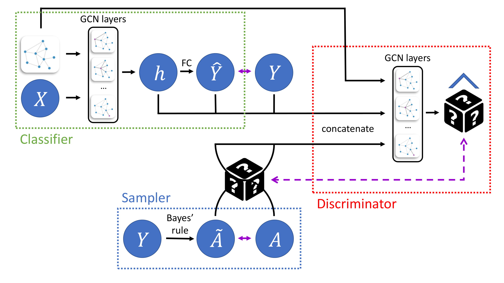

EqGNN: Equalized Node Opportunity in Graph
====

This repository provides a reference implementation of *EqGNN* as described in the paper:<br>
> EqGNN: Equalized Node Opportunity in Graphs<br>

The *EqGNN* algorithm is a fair graph neural network for equalized opportunity predictions.


## Requirements
 - torch==1.4.0
 - pytorch_lightning==1.0.7
 - dgl==0.5.3
 - networkx
 - sklearn
 - wandb

## Usage

```bash
python run.py \
    --dataset=${dataset} \
    --sensitive=${sensitive_attribute} \
    --log_path=${log_path} \
    --gpus=${gpus} \
    --lr=${learning_rate} \
    --wd=${weight_decay} \
    --dim=${embedding_size} \
    --epochs=${epochs} \
    --lmb=${lambda} \
    --gamma=${gamma} \
    --loss=${discriminator_loss} \
    --use_hidden
```

## Cite
Please cite our paper if you use this code in your own work:

```
@inproceedings{eqgnn,
  title={EqGNN: Equalized Node Opportunity in Graphs}
}
```