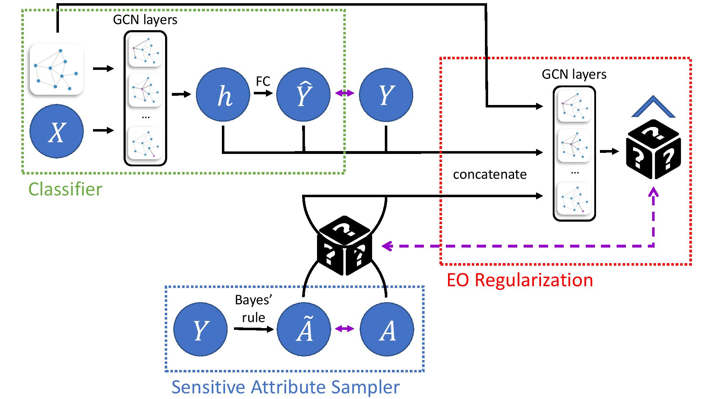

EqGNN: Equalized Node Opportunity in Graphs
====

This repository provides a reference implementation of *EqGNN* as described in the paper:<br>
> EqGNN: Equalized Node Opportunity in Graphs<br>

The *EqGNN* algorithm is a fair graph neural network for equalized opportunity predictions.


## Requirements
 - torch==1.7.1
 - pytorch_lightning==1.0.7
 - dgl==0.5.3
 - networkx==2.5
 - sklearn==0.23.2
 - pandas==1.1.5
 - numpy==1.19.2
 - scipy==1.5.2
 - wandb==0.10.12

## Usage

```bash
python run.py \
    --dataset=${dataset} \
    --sensitive=${sensitive_attribute} \
    --log_path=${log_path} \
    --gpus=${gpus} \
    --lr=${learning_rate} \
    --wd=${weight_decay} \
    --dropout=${dropout} \
    --dim=${embedding_size} \
    --epochs=${epochs} \
    --lmb=${lambda} \
    --gamma=${gamma} \
    --loss=${discriminator_loss} \
    --use_hidden
```

## Cite
Please cite our paper if you use this code in your own work:

```
@inproceedings{aaai2022-eqgnn,
  title     = {EqGNN: Equalized Node Opportunity in Graphs},
  author    = {Singer, Uriel and Radinsky Kira},
  booktitle = {Proceedings of the AAAI conference on artificial intelligence},
  year      = {2022},
  month     = {2},
}
```
